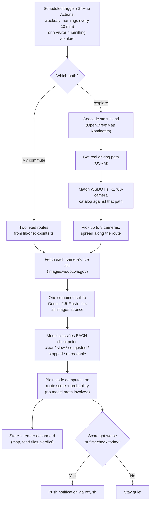

# Commute Watch

**Live at: [commute-dashboard-tau.vercel.app](https://commute-dashboard-tau.vercel.app/)**

   
This started because I set up [God's Eye View](https://github.com/bilawalsidhu/gods-eye-view) (spy-satellite-looking globe thing with live planes, ships, CCTV cameras, all that) and got fascinated with the idea that there's just... live public camera data sitting out there for the taking. I added WSDOT traffic cameras to it for my commute from Marysville to Bellevue, then thought 'why am I manually checking a globe app every morning when something could just look at the cameras and tell me "go now" or "wait 10 min"?' That led me to TypeSafe's JEV classifier which is a tiny, cheap model built for yes/no-score decisions instead of full chat responses and I built this around it.

Now every 10 minutes on weekday mornings, something reads live WSDOT camera stills along my two usual routes and pings my phone if it's getting worse. There's a map with a dot per camera colored by how bad that route looks, and a dashboard showing the actual live images not just a number. JEV didn't stick around though (still very cool to learn about this popular architecture!). Jev didnt stick around because it was scoring descriptions from a cheap vision model that kept bailing with "too dark to determine conditions" on half the cameras so JEV was just confidently scoring garbage. Not JEV's fault and we all know that because... garbage in, garbage out.

Ripped that out for one call: every camera image goes to Gemini 2.5 Flash-Lite at once, it classifies each into clear/slow/congested/stopped/unreadable, and plain code computes the route score from that — no model math. Forcing 5 fixed categories per image turned out way more repeatable than asking it to eyeball a whole route's severity, and it fixed the useless descriptions completely. I then burned an embarrassing amount of time chasing what looked like model flakiness (same route, hugely different scores seconds apart) before realizing I was refetching live images on every test i.e. the traffic itself was changing between runs, not the model. Froze real images to fixed bytes, ran the classifier 8x against the same bytes and it gave identical output every time. Also means this is dirt cheap at ~$0.0003/check, ~20 cents/month for my whole morning routine.

**Also added /explore for anyone else stuck in WA traffic: type any two places in the state, it geocodes them, gets a real driving route, finds WSDOT cameras along the way, and runs the same live check with no account, nothing saved. Rate-limited per visitor so nobody runs up my bill.**

## How a check works

## Stack, roughly

Next.js on Vercel, Upstash Redis for state + rate limiting, GitHub Actions for scheduling (Vercel's own cron jobs cap out at once/day on the free tier), Gemini 2.5 Flash-Lite via Vercel's AI Gateway for the actual reads, and OSRM + Nominatim for the `/explore` routing/geocoding.

**WSDOT APIs:**
- **Highway Cameras API** — the live still images every check is built on.
- **Traffic Flow API** — real loop-detector sensor readings near each camera, independent of the image entirely, shown as a "Sensor: ___" reading next to the AI's own read. Early results are mixed — it sometimes disagrees with what's visibly happening in the frame, so treat it as a second opinion, not ground truth.
