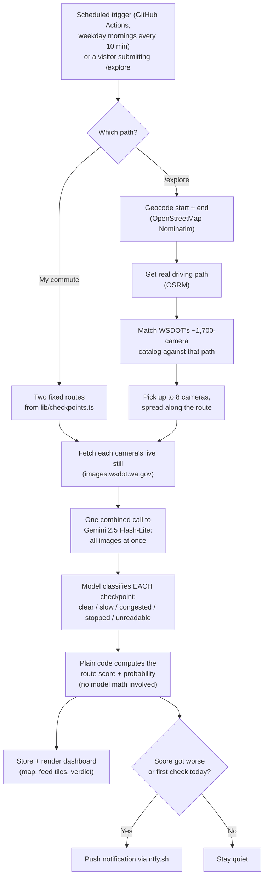

# Commute Watch

**Live at: [commute-dashboard-tau.vercel.app](https://commute-dashboard-tau.vercel.app/)**

   
This started because I set up [God's Eye View](https://github.com/bilawalsidhu/gods-eye-view) (spy-satellite-looking globe thing with live planes, ships, CCTV cameras, all that) and got kind of obsessed with the idea that there's just... live public camera data sitting out there for the taking. I added WSDOT traffic cameras to it for my own commute from Marysville to Bellevue, and then thought, why am I manually checking a globe app every morning when I could just have something look at the cameras for me and tell me "yeah go now" or "nah wait 10 min." That spiraled into finding TypeSafe's JEV classifier (found it through Vercel's AI Gateway, it's a genuinely tiny/cheap model built for exactly this kind of yes-no-score decision instead of full chat responses) and building this instead.

So now every 10 minutes on weekday mornings, something looks at live WSDOT camera stills along my two usual routes, describes what it sees, and pings my phone if it's getting worse. There's a little map with dots for every camera, colored by how bad that route looks, and a dashboard where I can see the literal live camera images instead of trusting some abstracted traffic app icon. I built it this way mostly because I wanted to actually see the road, not just a number, and because after fighting with Claude's cloud sandbox network restrictions for way too long I gave up and just made it a normal public website instead. Works better anyway.

Turns out JEV didn't stick around though. The descriptions it was scoring off of were coming from a cheap vision model that kept giving up with "too dark to determine traffic conditions" on half the cameras, so JEV was just confidently scoring garbage - not JEV's fault really, garbage in garbage out. Ripped the whole two-hop thing out and replaced it with one call: every camera image for a route goes to Gemini 2.5 Flash-Lite at once, it classifies each one into clear/slow/congested/stopped/unreadable, and the actual route score gets computed with plain math in code instead of asking the model to eyeball an aggregate number. Turns out forcing a model to pick from 5 fixed categories per image is a way more repeatable task than asking it to freely judge "how bad is this whole route" - and it fixed the useless descriptions completely, every camera gets a real read now instead of a shrug.

Spent a genuinely embarrassing amount of time chasing what looked like the model being flaky - same route, wildly different scores seconds apart. Turned out it wasn't the model at all: I was re-fetching live WSDOT images on every test, and the actual camera footage was changing between my test runs because, you know, time was passing and it's live traffic. Froze a set of real images to fixed bytes and ran the classifier against the literal same bytes eight times - byte-identical output every time. So it was never broken, I was just testing it wrong. Good reminder to isolate your variables before you go tearing out working code. Also means this is stupidly cheap - real measured cost is about $0.0003 per route check, so the whole scheduled morning routine runs for something like 20 cents a month.

Also added an `/explore` page since I figured other people stuck in WA traffic might want this without needing my exact commute. Type any two places in the state, it geocodes them, gets a real driving route, finds whatever WSDOT cameras sit along that path, and runs the same live check - no account, nothing saved, just a straight answer on how that drive looks right now. Rate-limited per visitor so nobody (including me testing it) can accidentally run up a bill.

## How a check actually works

## Stack, roughly

Next.js on Vercel, Upstash Redis for state + rate limiting, GitHub Actions for scheduling (Vercel's own cron jobs cap out at once/day on the free tier), Gemini 2.5 Flash-Lite via Vercel's AI Gateway for the actual reads, OSRM and Nominatim for the `/explore` routing/geocoding, and WSDOT's public camera API for literally all of the source footage.
